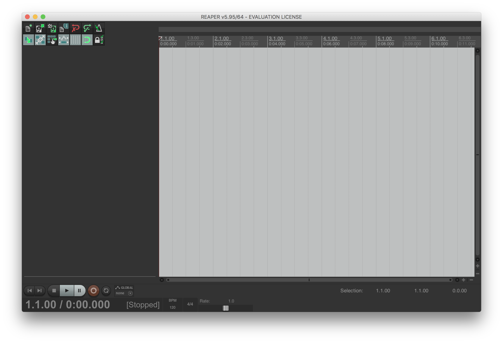

## Day 1

### Listening

* "Middle of the Field," Pieces of Air, Toshiya Tsunoda
* "Chicks In A Box- Ratna Park 1.21.05," Sounds Of Nepal Volumes 1 - 3, Aaron Dilloway
* "Loading Pick-Up Truck," Sounds of the Junk Yard
* "Bent Pipe," Extract From Field Recording Archive #1, Toshiya Tsunoda
* "Lake Tear of the Clouds, Mt. Marcy - The Source, Elevation 4.332 feet," A Sound Map of the Hudson River, Annea Lockwood
* "Feldspar Broom, Mt. Marcy - The Highest Tributary," A Sound Map of the Hudson River, Annea Lockwood

### Recording

Using your phone's Voice Memo app, or a similar one, go outside and find an outdoor space to record. Make five recordings, each 2 minutes in duration, from different positions in your selected location. Remember to bring headphones, a sound analog to a camera's viewfinder, so you know what you are recording.

### Simple Processing

1. Get your recordings off of your phone and onto your laptop
2. Download Reaper [here](https://www.reaper.fm/download.php)
3. Open Reaper, it should look like this

4. Open one of your recordings: `Insert > Media File`
5. Double Click on your file, which will open the `Properties` window. Click `Normalize`, then click `Apply`, and `OK` (if you are curious, you can read about normalization [here](https://en.wikipedia.org/wiki/Audio_normalization))
5. Right click on the file and go to `Item Settings`, scroll down to `Take Channel Mode: Mono (downmix)`. Your `Stereo` file is now `Mono`.
6. Click the `Play` button to listen to the `Mono` version of your recording
7. In the transport bar click and drag your cursor from the beginning of your file to the end. You should see two carrot looking markers at the beginning and end of your file, something like this

8. Click File > Render, which will open up a window that looks like this

9. Click on `Browse` and select the `Desktop` as the `Output Directory`
10. Click on `Bounds` and select `Time Selection`
11. Name your file, the `Render to File` window should look something like this

12. Click `Render 1 File`

### RPi

1. Connect your Raspberry Pi to power, when the green `ACT` light is flashing proceed to the next step
2. On your laptop open the **Terminal**: `Applications > Utilities > Terminal`
3. Navigate to the Desktop: `cd Desktop/` (the Terminal has autocomplete, press the TAB key after typing the first few letters of `Desktop` to use it), press ENTER
4. Send the file from the previous example to your Raspberry Pi: `scp FILENAME.wav pi@HOSTNAME.local:/home/pi/`
5. Connect to the Raspberry Pi from your laptop: `ssh pi@HOSTNAME.local`
2. Change
