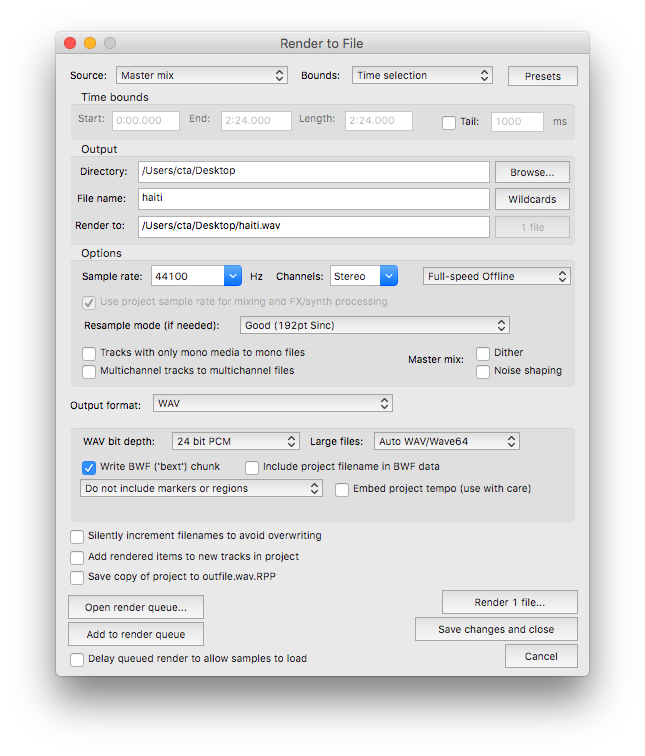

## Day 1

### Listening

* "Only [Harmony Series #17]," by Michael Pisaro, recording and realization by Jason Kahn
* "Middle of the Field," Pieces of Air, Toshiya Tsunoda
* "Chicks In A Box - Ratna Park 1.21.05," Sounds Of Nepal Volumes 1 - 3, Aaron Dilloway
* "Loading Pick-Up Truck," Sounds of the Junk Yard
* "Bent Pipe," Extract From Field Recording Archive #1, Toshiya Tsunoda
* "Lake Tear of the Clouds, Mt. Marcy - The Source, Elevation 4.332 feet," A Sound Map of the Hudson River, Annea Lockwood
* "Feldspar Broom, Mt. Marcy - The Highest Tributary," A Sound Map of the Hudson River, Annea Lockwood

### Recording

Using your phone's Voice Memo app, or a similar one, go outside and find an outdoor space, with a wide variety of sounds, to record. Make **five** recordings, each **2 minutes** in duration, from **five** different places in your selected location. Remember to bring headphones, a sound analog to a camera's viewfinder, so you know what you are recording.

### Basic Editing

1. Get your recordings off of your phone and onto your laptop
2. Download Reaper [here](https://www.reaper.fm/download.php)
3. Open Reaper, it should look something like this (you may notice that I am using the demo because I apparently lost my license file, heh)

4. Open one of your recordings: `Insert > Media File`
5. Double click on your file, which will open the `Properties` window. Click `Normalize`, then click `Apply`, and `OK` (if you are curious, you can read about normalization [here](https://en.wikipedia.org/wiki/Audio_normalization))
5. Right click on the file and go to `Item Settings`, scroll down to `Take Channel Mode: Mono (downmix)`. Your `Stereo` file is now `Mono`.
6. Click the `Play` button to listen to the `Mono` version of your recording
7. In the transport bar click and drag your cursor from the beginning of your file to the end. You should see two carrot looking markers at the beginning and end of your file, something like this

8. Click File > Render, which will open up a window that looks like this

9. Click on `Browse` and select the `Desktop` as the `Output Directory`
10. Click on `Bounds` and select `Time Selection`
11. In `Channels` select `Mono`
12. Name your file. The `Render to File` window should look something like this

12. Click `Render 1 File`

### RPi and loop_one.scd Prep

1. Connect your Raspberry Pi to power, when the green `ACT` light is flashing proceed to the next step
2. On your laptop open the **Terminal**: `Applications > Utilities > Terminal`
3. Navigate to the Desktop: `cd Desktop/` (the **Terminal** has autocomplete, press the TAB key after typing the first few letters of `Desktop` to use it), press ENTER
4. Send the file from the previous example to your Raspberry Pi: `scp FILENAME.wav pi@HOSTNAME.local:/home/pi/`, enter the login password to begin the file transfer
5. Connect to the Raspberry Pi from your laptop: `ssh pi@HOSTNAME.local`, enter the login password
6. Execute the following command to see your recording: `ls`
7. Make a new directory to hold all of your recordings: `mkdir recordings`
8. Move your recording into the directory you just made: `mv FILENAME.wav recordings/`
9. Clone this GitHub repo onto your Raspberry Pi: `git clone https://github.com/caseyanderson/slices_wkshp.git`
10. Navigate to the `loop_one` directory: `cd slices_wkshp/loop_one/`
15. Make `loop_one.scd` executable with the following: `sudo chmod +x loop_one.scd`
16. Go back to the home directory: `cd`
17. Open a hidden configuration file I forgot to change (sorry!): `sudo nano .jackdrc`
18. Using your arrow keys, move the cursor to `-dhw:1` and change the `1` to a `0`
19. Control+X to exit, Y to confirm changes, Enter to save

### testing loop_one.scd

1. From the home directory navigate to the SC directory (this sucks to type so remember to use autocomplete with TAB): `cd supercolliderStandaloneRPI2/`
2. run the following command (copy and paste it and then edit the filename): `xvfb-run --auto-servernum ./sclang -a -l ~/supercolliderStandaloneRPI2/sclang.yaml /home/pi/slices_wkshp/loop_one/loop_one.scd /home/pi/recordings/haiti.wav`

You should both hear your recording playing (plug headphones into the 3.5mm jack on the **RPi**) and see something like this if everything worked

### loop_one.scd: a brief explanation

The long-term goal is to have the **RPi** automatically launch this **SC** file on boot, which requires some special steps in our code:
* Unless we specify otherwise `scserver` runs with a default amount of memory. Increase the amount of memory `scserver` has access to with something like: `s.options.memSize = 8192 * 4`
* Timing in **SC** is not always exactly precise. In order to manage this one can increase the `latency` (amount of time it takes to do things) on `scserver`. Note that this crucially occurs before the start of `s.waitForBoot` block and is set to `0.05`
* The majority of the code in this file is wrapped in a `s.waitForBoot` [method](https://en.wikipedia.org/wiki/Method_(computer_programming)). `s.waitForBoot` evaluates, or runs, the code between curly brackets as soon as `scserver` has completed booting. We do not know exactly how long it will take for `scserver` to boot so this is an important protective measure
* We could [hardcode](https://en.wikipedia.org/wiki/Hard_coding) the **filepath** to our sample, or we could tell **SC** that it can expect that information when we execute the file (passed in as an argument). `thisProcess.argv`, on Line 20, allows us to access this information and use it in the script. We access the **filepath** on Line 32 with `thePath[0].asString`
* We need to make sure that **SC** waits until `scserver` is done adding our `play` `SynthDef` to the `SynthDescLib` (this is what `.add` does, btw) before trying to use it. In order to do so we include an `s.sync` on line 33. This is kind of like pausing the code until  `scserver` informs `sclang` that it is no longer busy. Since we do not know how long it will take to add `play` to the `SynthDescLib` `s.sync` is a very important tool here.
